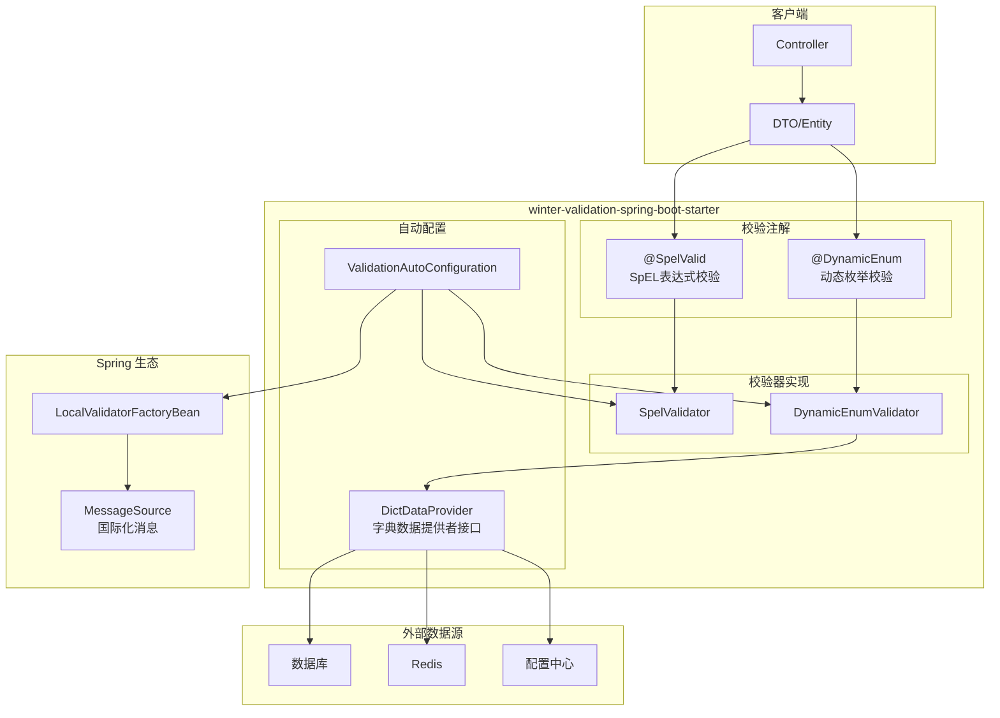
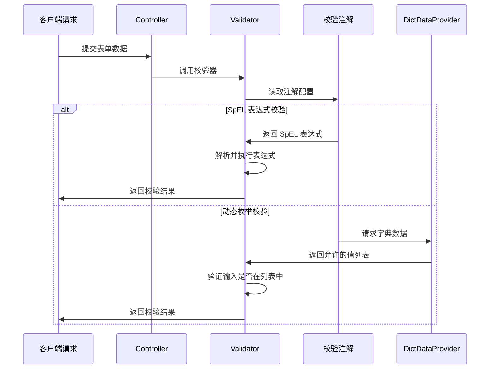
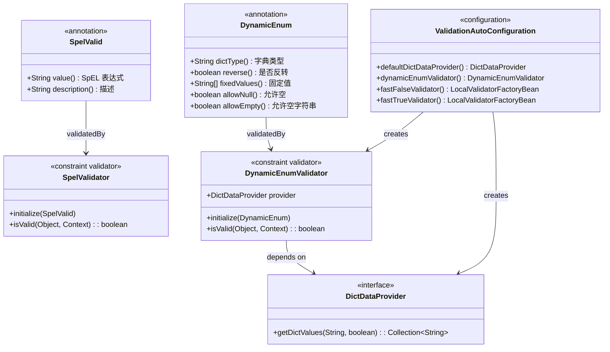

# winter-validation-spring-boot-starter


[](LICENSE)
[
[

一个强大的 Spring Boot 参数校验增强库，支持 SpEL 表达式校验和动态枚举校验，提供全量校验和快速失败两种策略。

---

## 技术栈

| 类别 | 技术 | 说明 |
|------|------|------|
|  | Java 8+ | 核心语言 |
|  | Spring Boot 2.6.x | 框架基础 |
|  | Hibernate Validator | 校验实现 |
|  | Lombok | 代码简化 |
|  | Maven | 构建工具 |
|  | Spring Context | IoC容器 |

## 功能特性

| 特性 | 说明 | 图标 |
|------|------|------|
| **SpEL 表达式校验** | 支持使用 Spring Expression Language 进行复杂字段校验 |  |
| **动态枚举校验** | 支持从外部数据源动态获取枚举值列表 |  |
| **双校验策略** | 全量校验（返回所有错误）和快速失败（遇到首个错误即返回） |  |
| **完整 Spring 集成** | 基于 Spring 容器管理，支持依赖注入和国际化 |  |


## 项目架构

### 整体架构图



### 校验流程图



### 核心类关系图



## 快速开始

### 1. 添加依赖

```xml
<dependency>
    <groupId>io.github.hahaha-zsq</groupId>
    <artifactId>winter-validation-spring-boot-starter</artifactId>
    <version>0.0.4</version>
</dependency>
```

### 2. 基本使用

```java
@RestController
public class UserController {
    
    @PostMapping("/user")
    public String createUser(@Valid @RequestBody UserDTO user) {
        return "success";
    }
}

@Data
public class UserDTO {
    @SpelValid("#this != null && #this.length() >= 2")
    private String name;
    
    @SpelValid("#root.age >= 18")
    private Integer age;
    
    @DynamicEnum(dictType = "user_status")
    private String status;
}
```

## ⚠️ 使用注意事项

### 1. 必须添加 @Valid 注解

校验注解不会自动生效，必须在 Controller 方法参数上添加 `@Valid` 注解：

```java
// ✅ 正确 - 开启校验
@PostMapping("/user")
public String createUser(@Valid @RequestBody UserDTO user) {
    return "success";
}

// ❌ 错误 - 校验不会生效
@PostMapping("/user")
public String createUser(@RequestBody UserDTO user) {
    return "success";
}
```

### 2. SpEL 表达式性能优化

SpEL 表达式在注解初始化时解析，后续使用缓存的表达式对象：

```java
// ✅ 推荐 - 表达式在启动时解析，运行时高效
@SpelValid("#this != null && #this.length() >= 2")
private String name;

// ⚠️ 注意 - 复杂的嵌套表达式可能影响性能
@SpelValid("#root.startTime.before(#root.endTime)")
private Date startTime;
```

### 3. 动态枚举的空值处理

根据业务需求合理配置空值处理策略：

```java
// 业务必填字段 - 不允许 null
@DynamicEnum(dictType = "user_status")
private String status;

// 业务可选字段 - 允许 null
@DynamicEnum(dictType = "user_role", allowNull = true)
private String role;

// 允许空字符串
@DynamicEnum(dictType = "nickname", allowEmpty = true)
private String nickname;
```

### 4. 校验策略选择

| 场景 | 推荐策略 | 说明 |
|------|----------|------|
| 表单提交 | 全量校验 | 用户希望一次性看到所有错误 |
| 批量导入 | 快速失败 | 性能优先，一行错即跳过 |
| 微服务调用 | 快速失败 | 追求极致性能 |
| 后台管理 | 全量校验 | 体验优先 |

### 5. 国际化消息配置

确保配置 `messages.properties` 文件：

```properties
# 位置: src/main/resources/messages.properties
SpEL.expression.validation.failed=SpEL 表达式校验失败
Value.is.not.in.the.allowed.range=值不在允许的范围内
```

### 6. DictDataProvider 实现注意事项

```java
@Service
public class DictDataProviderImpl implements DictDataProvider {
    
    // ✅ 推荐 - 添加缓存机制
    @Cacheable(value = "dict", key = "#dictType")
    @Override
    public Collection<String> getDictValues(String dictType, boolean reverse) {
        // 从数据库或缓存获取
        return dictMapper.findDictValues(dictType);
    }
    
    // ⚠️ 注意 - 不要每次都查询数据库
    // 建议结合 Redis 缓存使用
}
```

### 7. 嵌套对象校验

嵌套对象的校验需要在其属性上也添加 `@Valid`：

```java
@Data
public class OrderDTO {
    @Valid  // ✅ 必须添加，否则嵌套对象不会校验
    @NotNull
    private UserDTO user;
    
    @Valid  // ✅ 嵌套列表也需要
    @NotEmpty
    private List<ItemDTO> items;
}
```

### 8. groups 分组校验

不同场景使用不同的校验组：

```java
// 定义分组
public interface Create {}
public interface Update {}

// DTO 使用分组
@Data
public class UserDTO {
    @NotBlank(groups = {Create.class, Update.class})
    private String name;
    
    @Min(value = 18, groups = Create.class)  // 创建时校验
    private Integer age;
}

// Controller 指定分组
@PostMapping("/create")
public String create(@Validated(Create.class) @RequestBody UserDTO user) {
    // ...
}
```

---

## 使用指南

### SpEL 表达式校验

`@SpelValid` 注解支持使用 SpEL 表达式进行复杂的字段校验。

#### 注解参数

| 参数 | 类型 | 默认值 | 说明 |
|------|------|--------|------|
| value | String | - | SpEL 表达式 |
| message | String | "SpEL expression validation failed" | 错误消息 |
| description | String | "" | 描述信息 |

#### 表达式变量

| 变量名 | 说明 | 适用场景 |
|--------|------|----------|
| `#root` | 当前校验对象 | 跨字段校验 |
| `#this` | 当前字段值 | 单字段校验 |

#### 使用示例

**单字段校验**

```java
@Data
public class OrderDTO {
    @SpelValid("#this != null && #this.length() >= 2")
    private String orderName;
    
    @SpelValid("#this >= 0 && #this <= 1000")
    private Integer quantity;
    
    @SpelValid("#this.matches('^1[3-9]\\\\d{9}$')")
    private String phone;
}
```

**跨字段校验（类级别）**

```java
@SpelValid("#startTime.before(#endTime)")
@Data
public class ScheduleDTO {
    @JsonFormat(pattern = "yyyy-MM-dd HH:mm:ss")
    private Date startTime;
    
    @JsonFormat(pattern = "yyyy-MM-dd HH:mm:ss")
    private Date endTime;
}
```

**重复校验**

```java
@Data
public class ComplexDTO {
    @SpelValid.List({
        @SpelValid(value = "#this > 0", message = "必须大于0"),
        @SpelValid(value = "#this <= 100", message = "必须小于等于100")
    })
    private Integer value;
}
```

### 动态枚举校验

`@DynamicEnum` 注解支持从外部数据源动态获取允许的值列表。

#### 注解参数

| 参数 | 类型 | 默认值 | 说明 |
|------|------|--------|------|
| dictType | String | - | 字典类型标识 |
| reverse | boolean | false | 是否反转字典键值 |
| fixedValues | String[] | {} | 固定值列表 |
| allowNull | boolean | false | 是否允许 null |
| allowEmpty | boolean | false | 是否允许空字符串 |

#### 实现 DictDataProvider

```java
@Service
public class DictDataProviderImpl implements DictDataProvider {
    
    @Autowired
    private DictMapper dictMapper;
    
    @Override
    public Collection<String> getDictValues(String dictType, boolean reverse) {
        return dictMapper.findDictValues(dictType);
    }
}
```

#### 使用示例

```java
@Data
public class UserDTO {
    @DynamicEnum(dictType = "user_status")
    private String status;
    
    @DynamicEnum(dictType = "user_role", allowNull = true)
    private String role;
    
    @DynamicEnum(dictType = "gender", fixedValues = {"M", "F"})
    private String gender;
}
```

### 校验策略选择

#### 全量校验（默认）

返回所有字段的校验错误信息，适用于表单提交场景。

```java
@Autowired
private Validator validator;

public void validateForm(UserDTO user) {
    Set<ConstraintViolation<UserDTO>> errors = validator.validate(user);
    for (ConstraintViolation<UserDTO> error : errors) {
        System.out.println(error.getMessage());
    }
}
```

#### 快速失败

遇到第一个错误即返回，适用于高性能场景。

```java
@Autowired
@Qualifier("fastTrueValidator")
private Validator fastValidator;

public void validateFast(UserDTO user) {
    Set<ConstraintViolation<UserDTO>> errors = fastValidator.validate(user);
}
```

## API 参考

### @SpelValid

SpEL 表达式校验注解。

```java
@Target({ElementType.TYPE, ElementType.FIELD, ElementType.PARAMETER})
@Retention(RetentionPolicy.RUNTIME)
@Constraint(validatedBy = SpelValidator.class)
@Repeatable(SpelValid.List.class)
public @interface SpelValid {
    String message() default "SpEL expression validation failed";
    Class<?>[] groups() default {};
    Class<? extends Payload>[] payload() default {};
    String value();
    String description() default "";
}
```

### @DynamicEnum

动态枚举值校验注解。

```java
@Target({ElementType.FIELD, ElementType.PARAMETER})
@Retention(RetentionPolicy.RUNTIME)
@Constraint(validatedBy = DynamicEnumValidator.class)
public @interface DynamicEnum {
    String message() default "Value is not in the allowed range";
    Class<?>[] groups() default {};
    Class<? extends Payload>[] payload() default {};
    String dictType();
    boolean reverse() default false;
    String[] fixedValues() default {};
    boolean allowNull() default false;
    boolean allowEmpty() default false;
}
```

### DictDataProvider

字典数据提供者接口。

```java
public interface DictDataProvider {
    /**
     * 获取字典值集合
     * @param dictType 字典类型
     * @param reverse 是否反转
     * @return 允许的值集合
     */
    Collection<String> getDictValues(String dictType, boolean reverse);
    
    /**
     * 是否支持该字典类型
     */
    default boolean supports(String dictType) {
        return getDictValues(dictType, true) != null;
    }
}
```

### ValidationAutoConfiguration

自动配置类，提供两个 Bean：

| Bean 名称 | 类型 | 说明 |
|-----------|------|------|
| fastFalseValidator | LocalValidatorFactoryBean | 全量校验（默认） |
| fastTrueValidator | LocalValidatorFactoryBean | 快速失败校验 |
| dynamicEnumValidator | DynamicEnumValidator | 动态枚举校验器 |

## 国际化配置

在 `messages.properties` 中配置错误消息：

```properties
# 默认消息
SpEL.expression.validation.failed=SpEL 表达式校验失败
Value.is.not.in.the.allowed.range=值不在允许的范围内

# 自定义消息
user.name.not.empty=用户名不能为空
user.age.min=年龄必须大于等于 {value}
```

## 常见问题

### ❓ 校验不生效

确保在 Controller 方法上添加 `@Valid` 注解：

```java
@PostMapping("/user")
public String createUser(@Valid @RequestBody UserDTO user) {
    return "success";
}
```

### ❗ SpEL 表达式报错

检查表达式语法是否正确，表达式必须在初始化时能成功解析：

```java
// 正确示例
@SpelValid("#this != null && #this.length() >= 2")

// 错误示例（启动时即报错）
@SpelValid("#this.xx.yy()")
```

### 🔄 动态枚举值为空

检查 `DictDataProvider` 是否正确实现并注册为 Spring Bean：

```java
@Service
public class DictDataProviderImpl implements DictDataProvider {
    // 需要被 Spring 管理
}
```

### ⚡ 循环依赖错误

如果遇到 "Circular dependency" 错误，确保 `MessageSource` 使用 `@Lazy` 注入（本库已处理）。

## 🤝 贡献指南

欢迎提交 Issue 和 Pull Request！

1. Fork 本仓库
2. 创建特性分支 (`git checkout -b feature/xxx`)
3. 提交更改 (`git commit -m 'Add xxx'`)
4. 推送分支 (`git push origin feature/xxx`)
5. 创建 Pull Request

---

## 📊 项目信息

| 项目 | 信息 |
|------|------|
| 项目名称 | winter-validation-spring-boot-starter |
| 当前版本 |  |
| Java 版本 | Java 8+ |
| Spring Boot | 2.6.x |
| License | Apache License 2.0 |

### Maven 坐标

```xml
<dependency>
    <groupId>io.github.hahaha-zsq</groupId>
    <artifactId>winter-validation-spring-boot-starter</artifactId>
    <version>0.0.4</version>
</dependency>
```

### 构建命令

```bash
# 构建
mvn clean package

# 运行测试
mvn test

# 安装到本地仓库
mvn install
```

---

## 📄 License


Apache License 2.0 - see [LICENSE](LICENSE)
